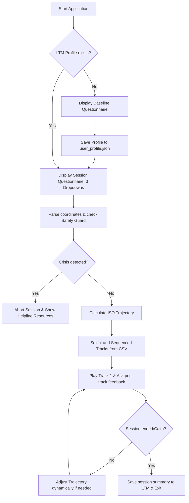

# Technical Collaborator Guide: AI-Based Music ISO-Therapy System

This document outlines the technical architecture, UI/UX questionnaire flows, state/memory management, skills, and security guardrails for developers collaborating on the codebase.

---

## 1. System Architecture & Multi-Agent Design
The project is built as a **Level 3 Multi-Agent System (MAS)** utilizing sequential orchestration. Reliability is achieved by using LLMs only for semantic tasks (dialogue, diagnostics, security) and deterministic Python code for calculations.

```text
┌────────────────────────────────────────────────────────┐
│               Session Coordinator Agent                │
│             (Main Controller & State Machine)          │
└───────────────────────────┬────────────────────────────┘
                            │
      ┌─────────────────────┼─────────────────────┐
      ▼                     ▼                     ▼
┌───────────┐         ┌───────────┐         ┌───────────┐
│Diagnostic │         │Trajectory │         │Safety Guard│
│  Agent    │         │Calculation│         │   Agent   │
│(Sentiment)│         │   Skill   │         │ (Regex/LLM)│
└───────────┘         └─────┬─────┘         └───────────┘
                            │
                            ▼
                     ┌─────────────┐
                     │Curated CSV  │
                     │  Database   │
                     └─────────────┘
```

---

## 2. UI/UX Flow & Questionnaire States

The application is stateful and runs in a structured loop. Below is the step-by-step logic:



### Questionnaire Specification
1.  **Baseline Questionnaire (First-time onboarding):** 
    *   *Inputs:* Adapt GAD-2 anxiety screening questions, default music genre preference (e.g., Rabindra Sangeet, modern acoustic, band music).
    *   *Goal:* Capture chronic stress thresholds and musical preference patterns.
2.  **Session Questionnaire (Start of session - Max 3 drop-downs):**
    *   *Input 1:* Current Valence (Pleasantness rating on a scale of -0.8 to +0.8).
    *   *Input 2:* Current Arousal (Energy/Activation rating on a scale of -0.8 to +0.8).
    *   *Input 3:* Session Goal (e.g., "Wind down to deep calm", "Uplift energy", "Mindful focus").
3.  **Active Feedback (After each track):**
    *   *Input:* Quick slider or 3-option selector (e.g., "Feeling calmer", "No change", "Feeling worse") to feed back into the Coordinator's trajectory adjustor.

---

## 3. State & Memory Management

### A. Short-Term Memory (Session Context)
Maintained in memory for the active execution session.
*   `session_id`: Unique session UUID.
*   `initial_mood`: Coordinate pair $(V_0, A_0)$ retrieved from the questionnaire.
*   `current_mood`: Updated coordinate pair $(V_i, A_i)$ as the session progresses.
*   `trajectory_points`: Pre-calculated list of coordinate targets.
*   `playlist_queue`: Ordered list of track IDs remaining to be played.
*   `play_history`: Track IDs played and the corresponding user feedback.

### B. Long-Term Memory (LTM Profile)
Stored locally in `Data/user_profile.json` to track baseline adjustments and long-term therapeutic effectiveness.
*   **Structure:**
    *   `baseline`: Onboarding questionnaire outcomes (anxiety baseline, genre preferences).
    *   `session_history`: High-level summaries of past sessions (start mood, end mood, playlist IDs, whether the user exited early).
*   **Usage:** Used by the Coordinator to prioritize tracks from the user's preferred genre and skip tracks that previously resulted in negative feedback ("feeling worse").

---

## 4. Skills and Tools

1.  **`Trajectory calculation tool (iso_trajectory_tool.py)`:**
    *   *Input:* `start_coords (tuple)`, `target_coords (tuple)`, `steps (int)`.
    *   *Logic:* Calculates linear interpolation points in 2D space.
    *   *Database query:* Performs Euclidean distance matching on the track CSV database:
        $$D = \sqrt{(V_{\text{track}} - V_i)^2 + (A_{\text{track}} - A_i)^2}$$
        Returns the top matching, unplayed track ID for each point.
2.  **`Profile persistence manager (profile_manager.py)`:**
    *   *Input:* User profile schema modifications.
    *   *Logic:* Reads and updates `user_profile.json`.

---

## 5. Security & Guardrails

To protect user safety and maintain clinical credibility, we implement three security layers:

### A. Therapeutic Safety Gate (Crisis Intervention)
*   **Mechanism:** A high-priority regex matcher combined with a prompt-engineered Safety Agent.
*   **Behavior:** Scans the text input from any conversational phase for indicators of clinical depression, self-harm, or active crisis (e.g., "suicide", "hurt myself", "hopeless", "can't go on").
*   **Action:** Immediately breaks out of the session state machine, stops music generation, and outputs pre-approved crisis hotline information (e.g., national helplines).

### B. Positive Loop Enforcement
*   **Mechanism:** Trajectory bounds checking.
*   **Behavior:** Prevents the system from entering a feedback loop that continues playing low-valence (depressive/sad) music.
*   **Action:** If a user reports "feeling worse" or "no change" after 2 tracks, the system is hardcoded to transition to neutral/soothing valence tracks or gracefully conclude the session with a grounding dialogue prompt, rather than matching the user's worsening negative state.

### C. Data Privacy
*   **Mechanism:** Local storage paradigm.
*   **Behavior:** All user mood metrics, chat responses, and history are kept strictly within `user_profile.json` on the client machine. No personal logs are transmitted to external endpoints (excluding LLM API calls which are stateless and must use data privacy configurations).
