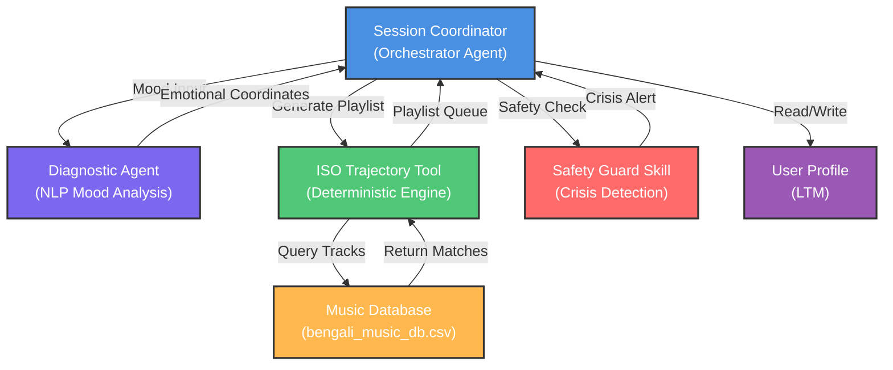
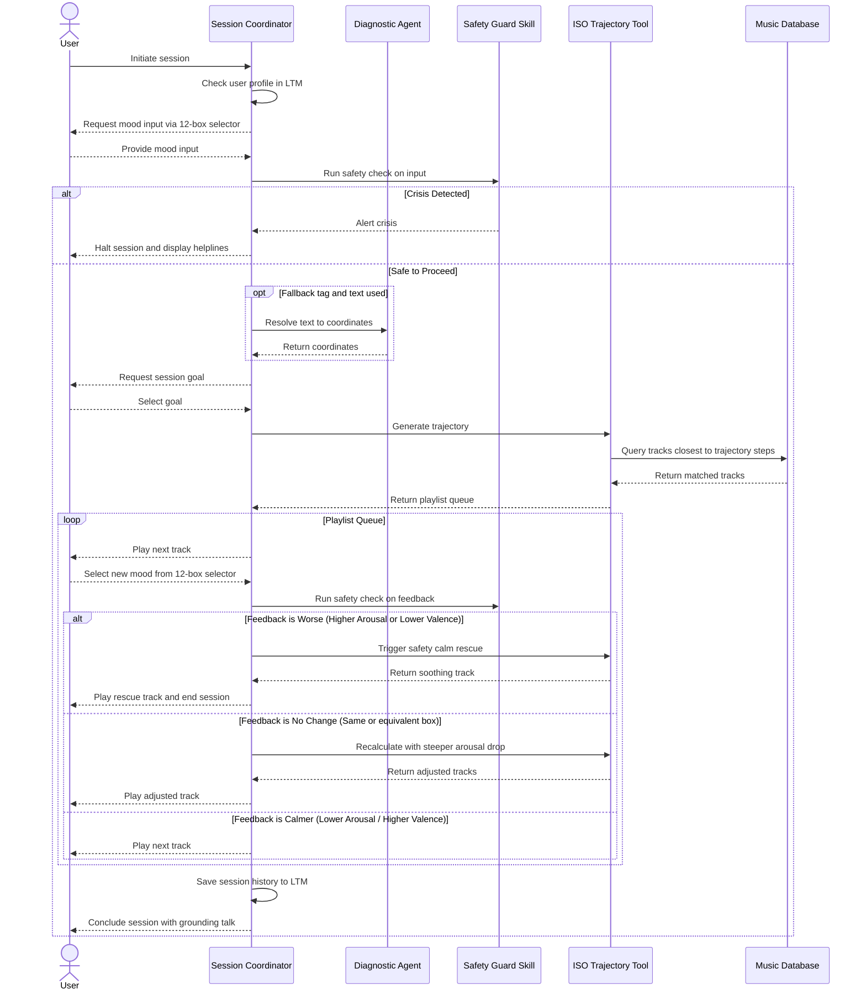

# Implementation Plan - Multi-Agent Bengali Music ISO-Therapy System (Notebook Version)

## Goal Description
Prepare and implement a stateful, multi-agent system based on the clinical **ISO principle** using curated Bengali music. The primary delivery is a Jupyter Notebook (`AI_based_music_therapy_ISO_System.ipynb`) leveraging the **Google Agent Development Kit (ADK)** for the *Agents for Good* track of the Vibe Coding Capstone Project. The system maps the user's emotional state in the 2D Valence-Arousal space, generates a matching trajectory, and guides the user to a target state of either **Calm** or **Focus for Study** while handling dynamic adjustments and clinical safety guardrails.

---

## Music Therapy & ISO Principle: Clinical Grounding

The **ISO Principle** is a core music therapy technique where the initial music played matches the client's current emotional/physiological state, and then gradually shifts in tempo, intensity, and valence to guide them toward a target state.

### 1. Russell's Circumplex Model of Affect
We map emotions and music tracks onto a two-dimensional coordinate system:
*   **Valence (Horizontal Axis, -1.0 to +1.0):** Measures the positivity/pleasantness of the emotion.
    *   Negative (-1.0) = Stressed, Sad, Numb.
    *   Positive (+1.0) = Happy, Serene, Calm.
*   **Arousal (Vertical Axis, -1.0 to +1.0):** Measures physiological activation and intensity.
    *   Low (-1.0) = Fatigued, Sleepy, Calm.
    *   High (+1.0) = Tense, Excited, Angry.

### 2. Core Therapeutic Trajectories
Our system focuses on two primary clinical transitions:
1.  **Stress to Calm** (Quadrant 2 $\rightarrow$ Quadrant 4)
    *   *Starting State (Stress)*: High Arousal, Negative Valence (e.g., $(-0.6, 0.8)$).
    *   *Target State (Calm)*: Low Arousal, High Valence (Target: $V_t = 0.75, A_t = -0.75$).
    *   *Clinical Progression*: Match user's tension (rock/heavy band covers) $\rightarrow$ Transition (bittersweet acoustic) $\rightarrow$ Stabilize (soothing flute/sitar or Rabindra Sangeet).
2.  **Excited to Focus for Study** (Quadrant 1 $\rightarrow$ Quadrant 4/Neutral)
    *   *Starting State (Excited/Hyper)*: High Arousal, Positive Valence (e.g., $(0.6, 0.6)$).
    *   *Target State (Focus)*: Mid-Low Arousal, Positive Valence (Target: $V_t = 0.50, A_t = -0.20$).
    *   *Clinical Progression*: Match high energy (upbeat folk/baul) $\rightarrow$ Transition (steady acoustic guitar) $\rightarrow$ Target (rhythmically steady, non-distracting instrumental sitar/flute to promote cognitive focus).

---

## Interactive Interface & Input Design

To calculate the user's starting coordinate $(V_0, A_0)$ and manage active session feedback consistently, the system uses a **12-Box Named Emotion Model** (based on Russell's Circumplex Model of Affect) with an optional natural language fallback:

1.  **The 12-Box Emotion Selector (Primary Input & Feedback UI)**:
    *   The user selects from 12 distinct emotional states, each mapped to a predefined coordinate in the 2D Valence-Arousal space (range $[-1.0, 1.0]$):
        *   `Afraid / Anxious`: $V = -0.6, A = +0.8$
        *   `Angry / Tense`: $V = -0.7, A = +0.6$
        *   `Distressed / Annoyed`: $V = -0.8, A = +0.2$
        *   `Sad / Gloomy`: $V = -0.7, A = -0.4$
        *   `Depressed / Miserable`: $V = -0.6, A = -0.7$
        *   `Bored / Tired`: $V = -0.3, A = -0.8$
        *   `Sleepy / Sluggish`: $V = 0.0, A = -0.9$
        *   `Calm / Relaxed`: $V = +0.7, A = -0.7$
        *   `Content / At Ease`: $V = +0.8, A = -0.3$
        *   `Happy / Pleased`: $V = +0.9, A = +0.1$
        *   `Joyous / Excited`: $V = +0.7, A = +0.6$
        *   `Surprised / Alert`: $V = 0.0, A = +0.8$

2.  **Hybrid Fallback UI (If user clicks "Help me choose" / "Unsure")**:
    *   The user can enter a natural language description (e.g., *"I'm really stressed about my exams"*).
    *   *LLM Diagnostic Agent*: Evaluates the text input and refines the baseline coordinates of the selected tag (or starts from neutral if no tag is selected) to capture fine-grained emotional nuances.

---

## State & Memory Management

### A. Short-Term Memory (Session Context)
Managed in-memory for the active session:
*   `session_id`: Unique identifier.
*   `initial_coords`: Start state $(V_0, A_0)$.
*   `current_coords`: Dynamic state $(V_i, A_i)$.
*   `goal_type`: `"calm"` or `"focus"`.
*   `playlist`: Generated 3-step sequence.
*   `played_tracks`: List of played track IDs to avoid fatigue.
*   `current_step`: Index of the current track (0, 1, or 2).

### B. Long-Term Memory (LTM Profile)
Stored locally in `user_profile.json` in the same directory as the notebook:
```json
{
  "user_id": "user_01",
  "baseline": {
    "gad2_score": 2,
    "chronic_valence_baseline": "neutral",
    "preferred_genre": "Rabindra Sangeet",
    "created_at": "2026-06-27T12:50:00Z"
  },
  "session_history": []
}
```

---

## Proposed System Design & Multi-Agent Architecture

### System Component Architecture



### Interaction Flow Diagram



---

## Proposed Changes

### Data & Config Files (In the same directory as the notebook)
*   **[NEW] [bengali_music_db.csv](file:///Users/bisnuchandrasarkar/Developer/Projects/agentic_ai/AI_based_music_therapy/bengali_music_db.csv)**:
    Static database of 50 curated Bengali tracks tagged with `valence`, `arousal`, `genre`, `is_instrumental`, and `youtube_url`.
*   **[NEW] [approved_mood_tags.json](file:///Users/bisnuchandrasarkar/Developer/Projects/agentic_ai/AI_based_music_therapy/approved_mood_tags.json)**:
    Mood tags categorization reference file.
*   **[NEW] [user_profile.json](file:///Users/bisnuchandrasarkar/Developer/Projects/agentic_ai/AI_based_music_therapy/user_profile.json)**:
    Long-Term Memory JSON file.

### Primary Jupyter Notebook
*   **[NEW] [AI_based_music_therapy_ISO_System.ipynb](file:///Users/bisnuchandrasarkar/Developer/Projects/agentic_ai/AI_based_music_therapy/AI_based_music_therapy_ISO_System.ipynb)**:
    Self-contained Jupyter Notebook that contains:
    1.  Setup & installation (`google-adk`, `pandas`, `nest-asyncio`).
    2.  Database auto-creation fallback logic (re-creates `bengali_music_db.csv` and `approved_mood_tags.json` locally if not found).
    3.  LTM read/write tools.
    4.  Deterministic trajectory matching code (genre-boosted, fatigue-excluding distance logic).
    5.  Dynamic Adjustment algorithms (rescue tracks for "worse", steeper step-down recalculations for "no_change").
    6.  Google ADK Agent definitions (Diagnostic, Coordinator) and deterministic Safety Guard Skill.
    7.  Safety Guard crisis matched helplines for India, Bangladesh, and globally.
    8.  Automated verification code (tests trajectory calculations, safety guards, and 12-box transition classification).
    9.  Interactive Session loop utilizing the 12-box Named Emotion selectors and instructions to run `adk web` UI.

---

## Verification Plan

### Automated Tests (Executed in the Notebook)
1.  **Trajectory Validation Test**: Asserts that trajectory coordinates decrease in arousal step-by-step for "stress to calm" and "excited to focus" pathways.
2.  **Genre Bias Validation Test**: Verifies that tracks in the user's preferred genre are correctly boosted in distance sorting.
3.  **Safety Guard Crisis Test**: Asserts that sending crisis phrases (e.g., "want to end my life") halts the session and returns crisis helpline resources.
4.  **Profile Update Test**: Verifies that session outcome summaries are written to `user_profile.json` correctly.

### Manual Verification
*   Simulating full user runs through the interactive Python text loop.
*   Testing agent functionality using the ADK Web UI cells.

---

## User Review Required

> [!IMPORTANT]
> **Plan Approval Checklist:**
> 1. Do the target coordinates for **Calm** $(0.70, -0.70)$ and **Study Focus** $(0.50, -0.20)$ meet your requirements?
> 2. Are the 12-box named emotional categories and coordinates aligned with the `arousal_valence.jpeg` reference?
> 3. Once this plan is approved, we will update the other design docs and write a script to generate the notebook (`AI_based_music_therapy_ISO_System.ipynb`) in the project directory.
