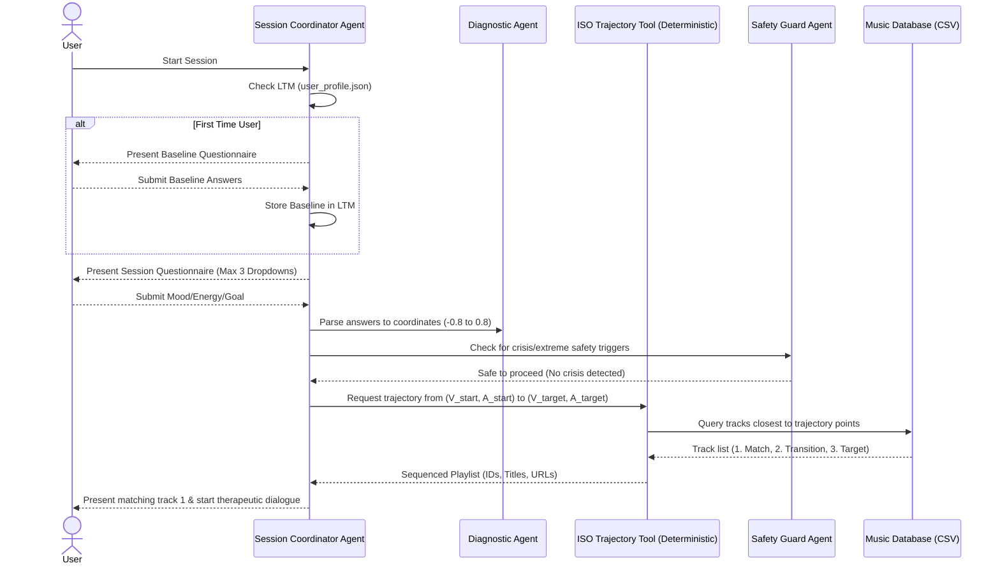

# Implementation Plan - Multi-Agent Bengali Music ISO-Therapy System

## Goal Description
Prepare a rigorous problem statement and system design to implement a stateful, multi-agent system based on the clinical **ISO principle** using curated Bengali music. This plan addresses the clinical knowledge gaps, defines the mathematical mapping in the Valence-Arousal space, outlines the drop-down questionnaire structures backed by psychological research, and details the Level 3 Multi-Agent architecture.

---

## Music Therapy & ISO Principle: Clinical Grounding

The **ISO Principle** is a core music therapy technique where the initial music played matches the client's current physiological/mood state, and then gradually shifts in tempo, intensity, and emotional character to guide them toward a target state (e.g., calm).

### 1. Russell's Circumplex Model of Affect
We map human emotions and music tracks onto a two-dimensional coordinate system:
*   **Valence (Horizontal Axis, -1.0 to +1.0):** Measures the positivity/pleasantness of the emotion.
    *   Negative (-1.0) = Sad, Tense, Depressed.
    *   Positive (+1.0) = Happy, Serene, Calm.
*   **Arousal / Energy (Vertical Axis, -1.0 to +1.0):** Measures physiological activation and intensity.
    *   Low (-1.0) = Fatigued, Sleepy, Calm.
    *   High (+1.0) = Tense, Excited, Angry.

```text
                     High Arousal (+1.0)
                            │
            Tense/Stressed  │  Happy/Excited
            (-0.6, +0.8)    │  (+0.6, +0.8)
                            │
Negative Valence ───────────┼─────────── Positive Valence (+1.0)
(-1.0)                      │
            Sad/Depressed   │  Calm/Serene
            (-0.6, -0.6)    │  (+0.6, -0.6)
                            │
                     Low Arousal (-1.0)
```

### 2. ISO-Principle Trajectory Matching
To guide a user from **Stressed** $(-0.6, 0.8)$ to **Calm** $(0.6, -0.6)$:
1.  **Match Phase:** Plays a track close to $(-0.6, 0.8)$ (high energy, tense/complex mood, e.g., acoustic rock with minor chords). This validates the user's emotional state.
2.  **Transition Phase:** Gradually steps down Arousal and shifts Valence.
    *   *Step 2:* $(-0.4, 0.3)$ (mid-energy, nostalgic/reflective, e.g., "Prithibita Naki").
    *   *Step 3:* $(0.1, -0.2)$ (low-mid energy, neutral/peaceful, e.g., acoustic folk).
3.  **Target Phase:** Plays a track matching $(0.6, -0.6)$ (low energy, high valence, e.g., "Anandoloke Mongololoke").

---

## Questionnaire Design & Research Backing

To map a user's emotional state to Valence-Arousal coordinates via minimal drop-down questions, we utilize research-backed scales from affective psychology:

1.  **The Affect Grid (Russell, Weiss, & Mendelsohn, 1989):** A single-item scale designed to measure valence and arousal simultaneously on a coordinate system. We translate the bipolar dimensions of the grid into direct semantic differential drop-downs.
2.  **Semantic Differential Scale (Bradley & Lang, 1994):** Evaluates emotions using bipolar adjectives (e.g., *Happy-Sad* for Valence, *Stimulated-Relaxed* or *Tense-Calm* for Arousal).
3.  **Generalized Anxiety Disorder-2 (GAD-2):** A brief clinical screening tool used to capture the user's chronic tension baseline.

### A. Initial Session Questionnaire (Baseline Registration)
*When a user first enters the system, we collect baseline preferences and chronic stress profile. This is stored in Long-Term Memory (LTM) and can be modified later in user settings.*

1.  **Chronic Anxiety Baseline (GAD-2 adapted):**
    *   *Question:* "Over the past two weeks, how often have you felt nervous, anxious, or on edge?"
    *   *Options:*
        *   "Not at all" (Score: 0)
        *   "Several days" (Score: 1)
        *   "More than half the days" (Score: 2)
        *   "Nearly every day" (Score: 3)
2.  **General Valence Baseline:**
    *   *Question:* "How would you describe your general mood mood over the past few days?"
    *   *Options:* Mostly Positive / Neutral / Mostly Negative.
3.  **Music Preference Profile:**
    *   *Question:* "Which genre of Bengali music do you connect with most when you need comfort?"
    *   *Options:* Rabindra Sangeet / Folk & Baul / Modern Acoustic / Bengali Rock.

### B. Subsequent Sessions Questionnaire (Max 3 Questions)
*Presented to the user at the start of each therapy session to immediately calculate their starting coordinate $(V_0, A_0)$.*

1.  **Current Valence (Pleasantness):**
    *   *Question:* "Right now, my mood feels..."
    *   *Options:*
        *   "Very Unpleasant / Highly Distressed" (Valence: -0.8)
        *   "Slightly Unpleasant / Down" (Valence: -0.4)
        *   "Neutral / Okay" (Valence: 0.0)
        *   "Pleasant / Peaceful" (Valence: 0.4)
        *   "Very Pleasant / Happy" (Valence: 0.8)
2.  **Current Arousal (Activation):**
    *   *Question:* "Right now, my energy level feels..."
    *   *Options:*
        *   "Tense / Agitated / Highly Alert" (Arousal: 0.8)
        *   "Active / Energetic" (Arousal: 0.4)
        *   "Neutral / Normal" (Arousal: 0.0)
        *   "Relaxed / Calm" (Arousal: -0.4)
        *   "Tired / Low Energy / Sluggish" (Arousal: -0.8)
3.  **Session Goal:**
    *   *Question:* "What is your target for this session?"
    *   *Options:*
        *   "Wind down to deep calm" (Target: Valence +0.7, Arousal -0.7)
        *   "Shift from low energy to focused/alert" (Target: Valence +0.6, Arousal +0.3)
        *   "Stay reflective / mindful transition" (Target: Valence +0.3, Arousal -0.3)

---

## Long-Term Memory (LTM) Profile Schema

A lightweight profile file `data/user_profile.json` stores user baseline details, persistent settings, and session outcomes.

```json
{
  "user_id": "user_01",
  "baseline": {
    "gad2_score": 2,
    "chronic_valence_baseline": "neutral",
    "preferred_genre": "Rabindra Sangeet",
    "created_at": "2026-06-21T06:17:34Z"
  },
  "session_history": [
    {
      "session_id": "session_101",
      "timestamp": "2026-06-21T06:20:00Z",
      "initial_state": { "valence": -0.8, "arousal": 0.8 },
      "target_state": { "valence": 0.7, "arousal": -0.7 },
      "playlist_played": ["track_03", "track_07", "track_12"],
      "user_feedback": {
        "ended_early": false,
        "final_mood_reported": { "valence": 0.4, "arousal": -0.4 }
      }
    }
  ]
}
```

---

## User Review Required

> [!IMPORTANT]
> **Plan Approval Checklist:**
> 1. Does the mapping of the drop-down options to numerical values (-0.8 to 0.8) feel correct for your mathematical model?
> 2. Are you aligned with storing user preferences in `data/user_profile.json` as our Long-Term Memory schema?
> 3. Once this plan is approved, we will begin writing code files in the `src/` directory.

---

## Proposed System Design & Multi-Agent Architecture



---

## Proposed Changes (Pending Approval)

### Data Layer
#### [NEW] [bengali_music_db.csv](file:///Users/bisnuchandrasarkar/Developer/Projects/agentic_ai/AI_based_music_therapy/Data/bengali_music_db.csv)
Contains ~20 curated Bengali tracks, tagged with: `track_id`, `title`, `artist`, `valence`, `arousal`, `youtube_url`, `description`.

#### [NEW] [user_profile.json](file:///Users/bisnuchandrasarkar/Developer/Projects/agentic_ai/AI_based_music_therapy/Data/user_profile.json)
LTM storage file initialization.

### Core Codebase
#### [NEW] [iso_trajectory_tool.py](file:///Users/bisnuchandrasarkar/Developer/Projects/agentic_ai/AI_based_music_therapy/src/iso_trajectory_tool.py)
Deterministic Python algorithm implementing the ISO trajectory calculations.

#### [NEW] [agents.py](file:///Users/bisnuchandrasarkar/Developer/Projects/agentic_ai/AI_based_music_therapy/src/agents.py)
Definitions for Coordinator, Diagnostic, and Safety Guard agents using ADK.

#### [NEW] [app.py](file:///Users/bisnuchandrasarkar/Developer/Projects/agentic_ai/AI_based_music_therapy/src/app.py)
A clean command-line interface (CLI) or local UI that hosts the session.

---

## Verification Plan

### Automated Tests
*   **Questionnaire Mapping Test:** Test that the parsing logic correctly translates drop-down inputs into exact float coordinate pairs.
*   **LTM Reading/Writing Test:** Test that the profile creation and updates to `user_profile.json` persist correctly.
*   **Trajectory Validation:** Test that the path generation follows monotonic changes in valence and arousal.
*   **Safety Guard Tests:** Unit tests verifying that input containing key crisis terms triggers safety alerts.

### Manual Verification
*   Execute simulated user sessions in the CLI/UI to verify flow transitions, LTM storage, and interaction quality.
