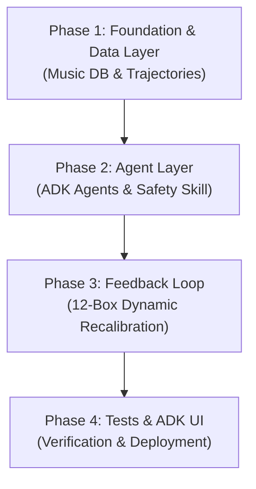

# Phased Implementation Plan - Bengali Music ISO-Therapy System

This document outlines the multi-phase roadmap for building and verifying the Multi-Agent Bengali Music ISO-Therapy System in a Jupyter Notebook (`AI_based_music_therapy_ISO_System.ipynb`).

---

## Overview of Phases

---

## Phase 1: Foundation & Data Layer (Data & Basic Math) [COMPLETED]

**Objective:** Build the local static datasets, user profile schemas, and mathematical pathfinding code.

### Tasks
1. **Curate Music Database:** [COMPLETED] Create [bengali_music_db.csv](file:///Users/bisnuchandrasarkar/Developer/Projects/agentic_ai/AI_based_music_therapy/bengali_music_db.csv) with 50 curated tracks representing all 12 circumplex emotional sectors, genre designations, instrumentals, and YouTube links.
2. **Setup Long-Term Memory (LTM):** [COMPLETED] Draft [user_profile.json](file:///Users/bisnuchandrasarkar/Developer/Projects/agentic_ai/AI_based_music_therapy/user_profile.json) schema for onboarding responses, genre preferences, and session history summaries.
3. **Write Trajectory Calculator:** [COMPLETED] Build the deterministic Python code that performs linear interpolation between a start coordinate $(V_0, A_0)$ and a target coordinate $(V_t, A_t)$, querying the CSV via Euclidean distance sorting with fatigue filtering (no duplicate tracks in a session).

---

## Phase 2: Agent Layer & Safety Skill (Core Mechanics) [COMPLETED]

**Objective:** Configure the multi-agent orchestration, the natural language diagnostic agent, and the deterministic safety guard.

### Tasks
1. **Initialize Google ADK Workspace & Multi-Agent Setup:** [COMPLETED]
   * **1.1 Environment Config:** [COMPLETED] Install ADK dependencies, set up api keys, and import libraries in `AI_based_music_therapy_ISO_System.ipynb`.
   * **1.2 Multi-Agent Architecture:** [COMPLETED] Define the communication channels and shared state structure in the notebook.
2. **Develop Diagnostic Agent (Natural Language Mood Analyst):** [COMPLETED]
   * **2.1 Empathetic Prompting:** [COMPLETED] Prompt-engineer the agent to analyze free-text descriptions (supporting mixed English, Bengali, and Benglish).
   * **2.2 Valence-Arousal Mapping:** [COMPLETED] Implement logic for translating the agent's textual evaluation into concrete circumplex coordinates ($V_d, A_d$).
   * **2.3 Verification:** [COMPLETED] Verify coordinate output boundaries (keeping coordinates within $[-1.0, 1.0]$ bounds).
3. **Implement Safety Guard Skill (Crisis Interceptor):** [COMPLETED]
   * **3.1 Keyword Dictionary:** [COMPLETED] Compile a dictionary of crisis, depression, and self-harm keywords in English and Bengali/Benglish.
   * **3.2 Regex Matching Engine:** [COMPLETED] Implement a fast, deterministic Python regex matcher to scan user text inputs.
   * **3.3 Interception Workflow:** [COMPLETED] Ensure that if the safety flag is tripped, all other agent responses and music playback are bypassed in favor of emergency crisis resources.
4. **Develop Coordinator Agent (State Orchestrator):** [COMPLETED]
   * **4.1 Orchestrator Prompting:** [COMPLETED] Draft the central agent prompt to manage session state transitions (Onboarding -> Diagnosis -> Trajectory Playback -> Feedback -> Session Wrap).
   * **4.2 Session State Management:** [COMPLETED] Define the session variables (current coordinate, playlist state, history, user preferences) passed between functions and agents.
   * **4.3 Verification:** [COMPLETED] Dry-run the coordinator's state transitions under normal and empty-input conditions.

---

## Phase 3: Active Feedback & Recalibration (Dynamic Adjustments)

**Objective:** Build the interactive loop and the 12-box dynamic recalculation algorithms.

### Tasks
1. **Develop Unified Feedback UI:**
   * **1.1 12-Box Visual & Selection Menu:** Display a 12-box named emotional selector to the user after each track concludes.
   * **1.2 Previous State Tracking:** Visually highlight or indicate the user's previous emotional state box to help them trace their path.
   * **1.3 Robust Input Validation:** Validate user selections to ensure correct formatting and matching against the 12 predefined mood categories.
2. **Implement Transition Logic & Classification:**
   * **2.1 Coordinate Delta Calculation:** Extract coordinates for the new state ($V_i, A_i$) and calculate the shift delta compared to the previous state ($V_{i-1}, A_{i-1}$).
   * **2.2 State Transition Categorization:** Implement rule-based classification to label the user's shift:
     * **Calmer (Positive Shift):** Valence increased and/or Arousal decreased.
     * **No Change:** Same emotional state/coordinates selected, or change is within a negligible Euclidean threshold.
     * **Worse (Negative/Agitated Shift):** Valence decreased and/or Arousal increased.
3. **Develop Recalibration Algorithms:**
   * **3.1 Calmer Path:** Continue playing the remaining queue of the current trajectory undisturbed.
   * **3.2 No-Change Recalibration Engine:** Dynamically adjust the remaining trajectory by reducing target arousal further ($A_{target} - 0.15$), filtering out the stale genre, and re-querying the database with a boost for the user's preferred genre.
   * **3.3 Worse State Rescue Interception:** Abruptly halt the session queue, override all coordinator states, and immediately queue a pre-designated clinical deep-calm rescue track (e.g., devotional/sitar instrumental).
4. **Develop Session Concluder & Memory Integration:**
   * **4.1 Grounding Prompts:** Guide the user through breathing/grounding exercises (delivered via Coordinator dialogue) based on their ending mood.
   * **4.2 LTM Logging:** Write session metadata (initial coordinates, final coordinates, list of played tracks, outcome status) into the local `user_profile.json` file.
   * **4.3 Baseline Profiling:** Update user profile statistics and adjust the baseline preferences for future sessions based on the success of the current session.

---

## Phase 4: Automated Verification & UI Launch (Testing & Delivery)

**Objective:** Verify the clinical logic and run the full ADK browser-based interface.

### Tasks
1. **Write Automated Tests:**
   * **1.1 Test Trajectory Calculation & Constraints:** Write tests asserting correct trajectory math, boundary clamping $[-1.0, 1.0]$, and fatigue-prevention filtering.
   * **1.2 Test Target Coordinate Configurations:** Verify target assignments map correctly to Calm $(0.70, -0.70)$ and Study Focus $(0.50, -0.20)$.
   * **1.3 Test Safety Guard Interception:** Check that safety crisis triggers work reliably for crisis phrases in both Bengali/Benglish and English.
   * **1.4 Test LTM Read/Write Integrity:** Ensure user profile and session logs are read/written correctly from/to `user_profile.json` without file corruption.
2. **Conduct Manual Loop Dry Runs:**
   * **2.1 Simulate Stress-to-Calm Progression:** Verify loop behavior when simulating a highly stressed starting state transitioning to the Calm target coordinate.
   * **2.2 Simulate Excited-to-Focus Progression:** Verify loop behavior when simulating a hyper/excited starting state transitioning to the Study Focus target coordinate.
   * **2.3 Test Recovery and Recalibration Paths:** Walk through manual inputs mimicking "No Change" and "Worse" states to confirm active adjustment and rescue tracks fire.
3. **Setup ADK Web UI:**
   * **3.1 Configure Agent Manifests for Web:** Ensure Coordinator and Diagnostic agents are configured for Web client integration.
   * **3.2 Embed Web UI Startup Instructions:** Write detailed cell documentation and CLI command triggers (`adk web`) in the notebook.
   * **3.3 End-to-End Browser Verification:** Run the local ADK Web server to visually test user onboarding, chatting, mood diagnostics, and track recommendations.
